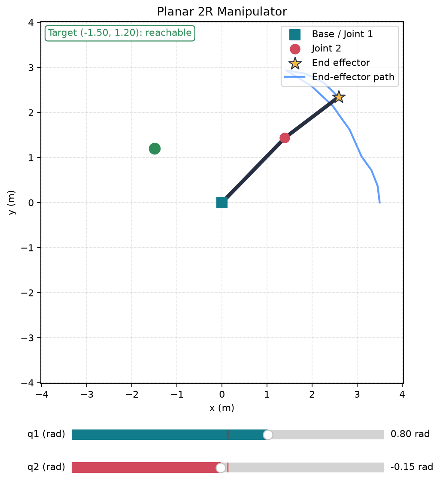
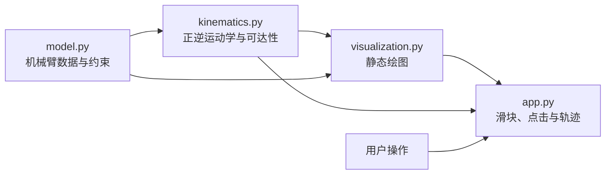

# ROS 2 Vision-Guided Intelligent Manipulator

**中文名称：基于 ROS 2 的视觉引导智能机械臂抓取系统**

这是一个面向机器人初学者的长期学习项目。项目从纯 Python 的二维二连杆机械臂开始，计划逐步升级为使用 ROS 2、Gazebo、MoveIt 2 和虚拟相机的抓取与放置系统。

> 当前状态：**Version 1.0 已完成，Version 2.0 开发中**。V1.0 已由 `v1.0.0` 永久保存；V2.0 正在独立分支中逐步增加逆运动学、轨迹规划、控制与避障。

## 版本导航

| 版本 | 状态 | 代码入口 | 主要内容 |
| --- | --- | --- | --- |
| V1.0 | 已完成 | [`v1.0.0`](https://github.com/jiajun-shen/ros2-intelligent-manipulator/tree/v1.0.0) | 数据模型、正运动学、交互绘图、工作空间与轨迹记录 |
| V2.0 | 开发中 | [`V2.0 development`](https://github.com/jiajun-shen/ros2-intelligent-manipulator/tree/agent/v2-0-constrained-inverse-kinematics) | 解析逆运动学、奇异检测与关节限制；其他功能逐步加入 |
| V3.0 | 未开始 | 完成 V2.0 后创建 | ROS 2、Gazebo、MoveIt 2 三维抓取 |
| V4.0 | 未开始 | 完成 V3.0 后创建 | 虚拟相机视觉引导抓取 |
| V5.0 | 未开始 | 完成 V4.0 后创建 | 任务规划、失败检测和自动恢复 |

仓库采用“一个连续项目、每代独立开发分支、完成后合并到 `main` 并创建永久标签”的方式管理。详细规则见 [`docs/versioning.md`](docs/versioning.md)。



## Version 1.0 功能

- 使用 dataclass 表示关节限制和二维二连杆机械臂。
- 检查连杆长度、关节限制和初始关节角是否合法。
- 自行实现二维 2R 机械臂正运动学。
- 使用 Matplotlib 绘制基座、关节、连杆和末端执行器。
- 使用 `q1`、`q2` 滑块交互修改机械臂构型。
- 计算理想几何工作空间及目标点可达性。
- 鼠标点击目标点并显示 `reachable` 或 `unreachable`。
- 记录并显示滑块运动过程中末端执行器的轨迹。
- 使用 pytest 验证数据模型、运动学、工作空间和交互行为。

## 快速体验

完成一次环境安装后，推荐直接在 VS Code 中运行：

1. 使用 VS Code 打开项目文件夹。
2. 在右下角选择项目中的 `.venv` Python 解释器。
3. 打开 [`examples/run_interactive_arm_2d.py`](examples/run_interactive_arm_2d.py)。
4. 点击编辑器右上角的 **Run Python File** 三角形按钮。

运行窗口中可以：

- 拖动 `q1 (rad)` 和 `q2 (rad)` 改变两个关节角。
- 观察蓝色 `End-effector path` 末端运动轨迹。
- 在坐标图中单击鼠标左键选择目标点。
- 观察绿色可达目标或红色不可达目标。

关闭窗口后，本次内存中的目标点和轨迹会被清空。

首次安装、解释器选择和常见错误见 [`docs/setup.md`](docs/setup.md)。

## 一条命令运行

在已经安装本项目并启用虚拟环境的情况下：

```bash
python examples/run_interactive_arm_2d.py
```

## 数学模型

机械臂包含两根连杆 `L1`、`L2` 和两个旋转关节 `q1`、`q2`，因此称为 2R 机械臂。`q1` 是第一根连杆相对于世界坐标系 x 轴的角度，`q2` 是第二根连杆相对于第一根连杆的角度。

```text
world y
  ^
  |               end effector
  |                    *
  |                   /  L2
  |          joint 2 o   q2
  |                 /
  |              L1/ q1
  |               /
  +--------------o------------------> world x
              base / joint 1
```

正运动学使用以下公式：

```text
x1 = L1 * cos(q1)
y1 = L1 * sin(q1)

xe = x1 + L2 * cos(q1 + q2)
ye = y1 + L2 * sin(q1 + q2)
```

目标点到基座的距离为 `r`。在暂不考虑关节限制时，理想几何可达条件是：

```text
abs(L1 - L2) <= r <= L1 + L2
```

## 软件结构



```text
ros2-intelligent-manipulator/
├── docs/
│   ├── images/                         # README 使用的真实运行截图
│   ├── releases/v1.0.0.md              # Version 1.0 发布说明
│   ├── setup.md                        # 环境安装与故障排查
│   └── versioning.md                   # 分支、标签和版本发布规则
├── examples/
│   ├── check_reachability.py           # 命令行可达性示例
│   ├── run_arm_2d.py                   # 静态机械臂示例
│   └── run_interactive_arm_2d.py       # 推荐的完整交互 Demo
├── src/manipulator_2d/
│   ├── app.py                          # 交互应用
│   ├── kinematics.py                   # 运动学与工作空间
│   ├── model.py                        # 数据模型和有效性检查
│   └── visualization.py                # Matplotlib 绘图
├── tests/                              # 自动化测试
├── LICENSE
├── pyproject.toml
└── README.md
```

## 示例程序

| 文件 | 用途 | 是否打开图形窗口 |
| --- | --- | --- |
| `examples/run_interactive_arm_2d.py` | 滑块、目标点击、可达性和轨迹 | 是 |
| `examples/run_arm_2d.py` | 绘制一个固定构型 | 是 |
| `examples/check_reachability.py` | 输出工作空间半径和目标判断 | 否 |

更多说明见 [`examples/README.md`](examples/README.md)。

## 测试与检查

```bash
python -m pytest
ruff check .
ruff format --check .
```

Version 1.0 验收时共有 **36 项测试**。当前 V2.0 开发分支共有 **53 项测试**，覆盖以下内容：

- 合法和非法的数据模型输入。
- 正运动学已知构型与浮点近似比较。
- 工作空间内边界、外边界和不可达目标。
- 绘图坐标是否来自正运动学结果。
- 滑块更新、目标点击和轨迹记录。
- 解析逆运动学、角度规范化、奇异检测和关节限制筛选。
- Python 包版本与最小导入检查。

## V1.0 验收

- [x] 一条命令可以启动二维机械臂 Demo。
- [x] 修改 `q1`、`q2` 后图形正确更新。
- [x] 正运动学结果经过自动化测试。
- [x] 点击目标时显示目标位置及几何可达性。
- [x] 显示基座、两个关节、末端执行器和运动轨迹。
- [x] README 包含安装、运行、测试和限制说明。
- [x] pytest、Ruff 和格式检查全部通过。

## 实现边界

我们自行实现了数据模型、输入检查、正运动学公式、理想工作空间判断，以及交互应用中的状态管理和轨迹记录。

Matplotlib 提供图形窗口、坐标轴、绘图元素、滑块控件和鼠标事件基础设施。项目没有把第三方库提供的绘图功能描述成自行实现的机器人算法。

## 已知限制

- 当前是理想二维刚性机械臂，没有质量、惯量、摩擦或动力学。
- V1.0 的目标可达性只依据连杆长度形成的理想圆环；V2.0 数学层已经能够筛选关节限制。
- 解析逆运动学已经实现，但尚未接入鼠标点击界面，因此点击目标暂时不会让机械臂自动移动。
- 蓝色轨迹连接滑块事件采样到的位置，不是规划器生成的时间轨迹。
- 当前没有碰撞检测、障碍物、PID 控制、ROS 2、Gazebo 或 MoveIt 2。

## 五代路线

| 版本 | 主题 | 状态 |
| --- | --- | --- |
| 1.0 | Python 二维机械臂基础模型 | 已完成 |
| 2.0 | 逆运动学、轨迹规划、PID 和避障 | 开发中：解析逆运动学与约束处理已完成 |
| 3.0 | ROS 2、Gazebo、MoveIt 2 三维抓取 | 未开始 |
| 4.0 | 虚拟相机视觉引导抓取 | 未开始 |
| 5.0 | 任务规划、失败检测和自动恢复 | 未开始 |

每一代都在上一代代码基础上升级。当前代完成测试与文档验收后才会合并到 `main` 并创建对应的永久标签。

## Release Notes

- [Version 1.0.0](docs/releases/v1.0.0.md)

## License

本项目使用 [MIT License](LICENSE)。
